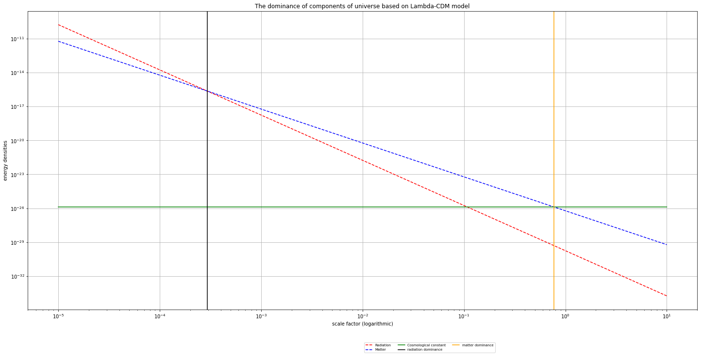

# Numerical_Friedmann_fate_of_universe

Numerical integration of the Friedmann equations to simulate cosmic evolution across different cosmological density parameters. This project investigates the role of radiation, matter, curvature, and dark energy in determining the geometry, expansion history, and ultimate fate of the universe.

## The Physics

The large-scale evolution of the universe can be described by the Friedmann equations:

$$
\left(\frac{\dot a}{a}\right)^2 = \frac{8\pi G}{3}\rho - \frac{k}{a^2} + \frac{\Lambda}{3}
$$

$$
\frac{\ddot a}{a} = -\frac{4\pi G}{3}(\rho + 3P) + \frac{\Lambda}{3}
$$

where:

- \(a\) : scale factor
- \(\rho\) : energy density
- \(P\) : pressure
- \(k\) : spatial curvature
- \(\Lambda\) : cosmological constant (dark energy)

The first equation describes the expansion rate of the universe, while the second equation (also known as the Raychaudhuri equation) describes the acceleration or deceleration of cosmic expansion.

Although these equations appear straightforward, the energy density is itself time-dependent:

$$
\rho = \rho(t)
$$

Therefore, solving the Friedmann equations requires understanding how each component evolves as the universe expands.

## Density Parameters and Normalized Friedmann Equation

To simplify the equations, cosmology defines the critical density:

$$
\rho_c = \frac{3H_0^2}{8\pi G}
$$

and the density parameter:

$$
\Omega = \frac{\rho}{\rho_c} = \frac{8\pi G\rho}{3H_0^2}
$$

Each component evolves differently with respect to the scale factor according to its equation of state:

$$
\rho_r \propto a^{-4}
$$

$$
\rho_m \propto a^{-3}
$$

$$
\rho_k \propto a^{-2}
$$

$$
\rho_\Lambda = \text{constant}
$$

where radiation scales as \(a^{-4}\), matter scales as \(a^{-3}\), curvature scales as \(a^{-2}\), and dark energy remains constant.

Using these relations, the normalized Friedmann equation becomes

$$
\left(\frac{H(a)}{H_0}\right)^2 = \Omega_r a^{-4} + \Omega_m a^{-3} + \Omega_k a^{-2} + \Omega_\Lambda
$$

where the curvature density parameter is defined as

$$
\Omega_k = -\frac{k}{a_0^2 H_0^2}
$$

with \(a_0 = 1\) at the present epoch.

The acceleration equation becomes

$$
\frac{\ddot a}{a} = H_0^2\left(-\Omega_r a^{-4} - \frac{1}{2}\Omega_m a^{-3} + \Omega_\Lambda\right)
$$

## Curvature Constraint and Geometry of the Universe

Evaluating the Friedmann equation at the present epoch leads to the normalization condition

$$
\Omega_r + \Omega_m + \Omega_\Lambda + \Omega_k = 1
$$

Therefore, the curvature contribution is not fully independent and can be computed through

$$
\Omega_k = 1 - (\Omega_r + \Omega_m + \Omega_\Lambda)
$$

The total density parameter is defined as

$$
\Omega_{\text{total}} = \Omega_r + \Omega_m + \Omega_\Lambda
$$

and determines the spatial geometry of the universe:

- $$\Omega_{\text{total}} < 1$$ : Open universe
- $$\Omega_{\text{total}} = 1$$ : Flat universe
- $$\Omega_{\text{total}} > 1$$ : Closed universe

Equivalently:

- $$\Omega_k > 0$$ : Open universe
- $$\Omega_k = 0$$ : Flat universe
- $$\Omega_k < 0$$ : Closed universe

Although geometry is determined by the total density parameter, the ultimate fate of the universe depends on the relative contributions of each component. Universes with identical geometry may evolve very differently depending on the balance between matter, curvature, and dark energy.

This project explores both realistic and hypothetical cosmological models by varying the density parameters while maintaining consistency with the Friedmann normalization condition.

## Domination of Cosmological Components

Since each component evolves differently with the scale factor, different eras of cosmic history become dominated by different energy components.

Using the Planck 2018 cosmological parameters [(Aghanim et al. 2018)](https://arxiv.org/abs/1807.06209):

$$
\Omega_r = 9.24\times10^{-5}
$$

$$
\Omega_m = 0.315
$$

$$
\Omega_k = 0
$$

$$
\Omega_\Lambda = 0.685
$$

we recover the standard \(\Lambda\)CDM cosmological model.

The following logarithmic plot illustrates the evolution of each component with the scale factor:

As expected, the universe begins with a short radiation-dominated era, followed by matter domination, and eventually transitions into dark-energy domination at late times.

The standard \(\Lambda\)CDM model assumes a spatially flat universe (\(\Omega_k = 0\)). However, observational constraints only require

$$
\Omega_{\text{total}} = 1 \pm \epsilon
$$

allowing the possibility of a small but non-zero curvature contribution. This motivates investigating how open and closed cosmological models modify the expansion history and dominance eras of the universe.
